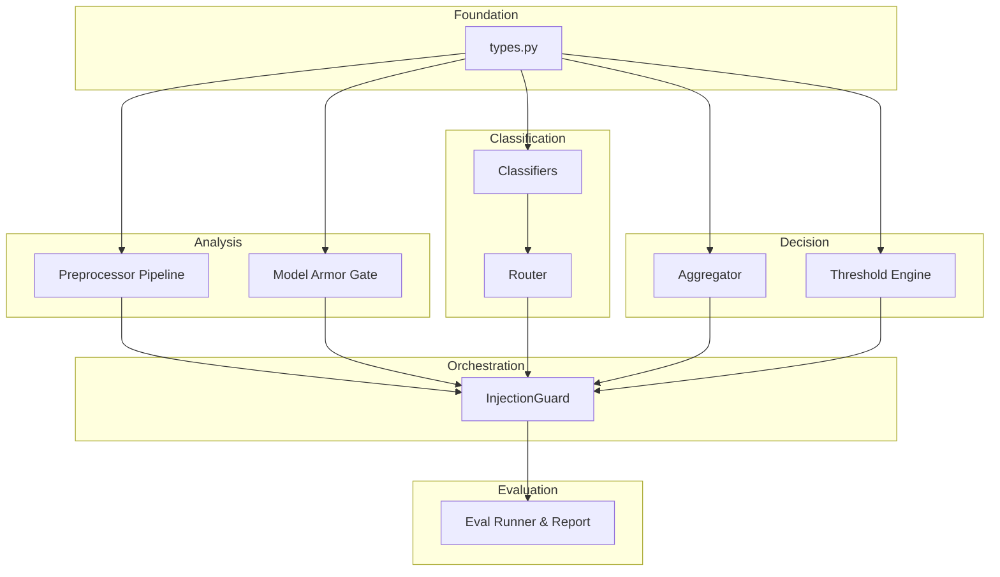
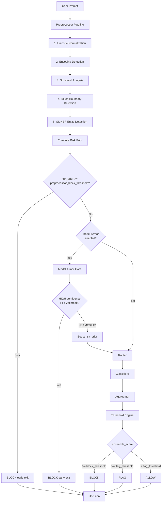
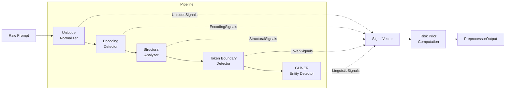
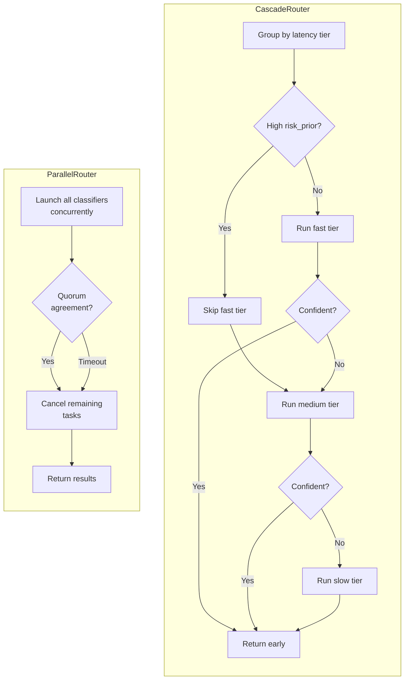
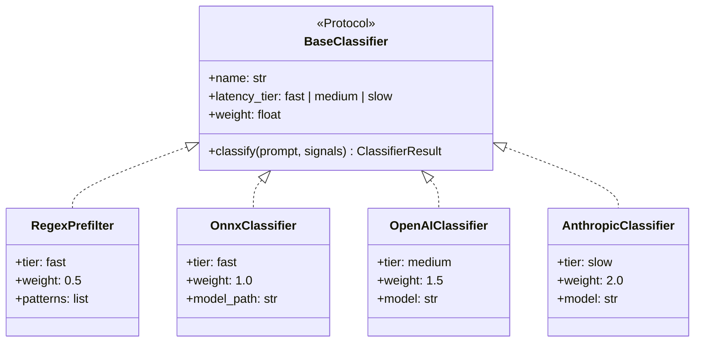
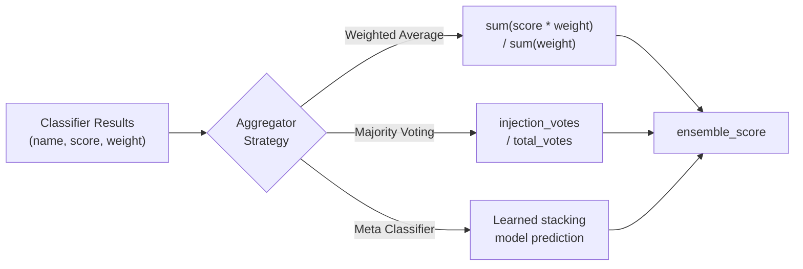
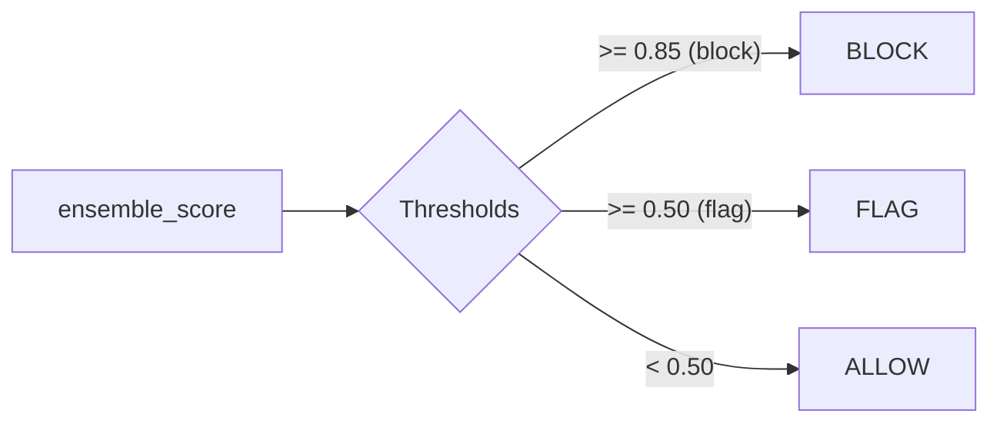
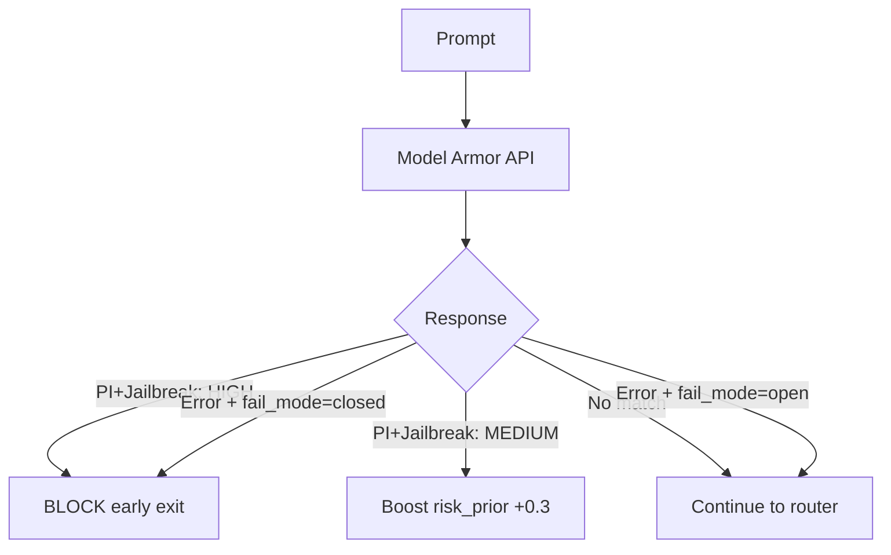
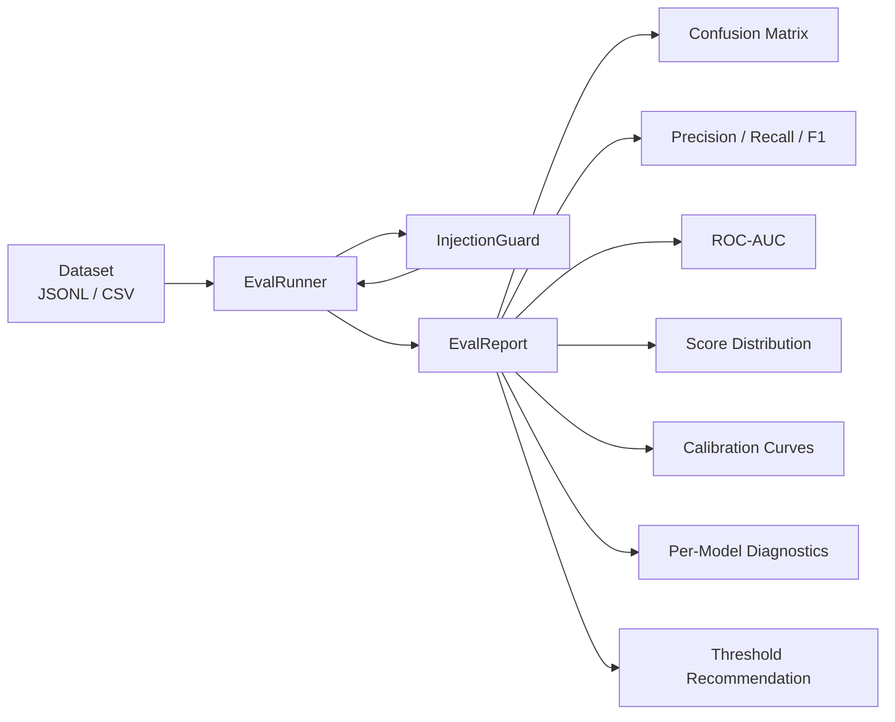
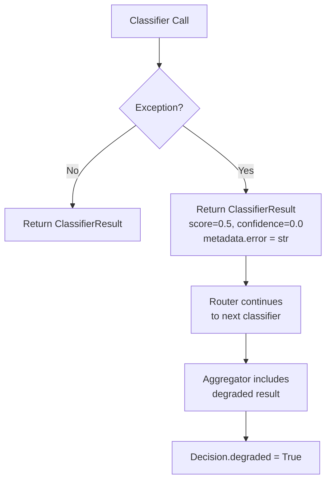

# injection-guard

Prompt injection detection library with an ensemble classifier architecture.
Async-first Python, pluggable classifiers (regex, ONNX, OpenAI, Anthropic), and a full evaluation toolkit.

## Architecture Overview



## Request Lifecycle

Every call to `InjectionGuard.classify()` follows this pipeline:



## Preprocessor Pipeline

Five stages extract signal vectors from the raw prompt before classification.



| Stage | Detects | Key Signals |
|-------|---------|-------------|
| Unicode | Homoglyphs, zero-width chars, bidi overrides, script mixing | `homoglyph_count`, `zero_width_count`, `script_mixing` |
| Encoding | Base64, hex, URL-encoding, HTML entities, nesting | `encodings_found`, `encoding_density`, `nested_encoding` |
| Structural | Chat delimiters, XML/HTML tags, instruction boundaries | `chat_delimiters_found`, `separator_density` |
| Token | Split-keyword attacks, prompt stuffing, repetition | `reconstructed_keywords`, `repetition_ratio` |
| GLiNER | Injection-specific named entities (instruction override, role assignment, etc.) | `entity_count`, `max_entity_confidence` |

## Routing Strategies

Two router implementations control how classifiers are invoked.



## Classifiers

All classifiers implement the `BaseClassifier` protocol.



| Classifier | Tier | Weight | Approach |
|------------|------|--------|----------|
| RegexPrefilter | fast | 0.5 | Keyword pattern matching |
| OnnxClassifier | fast | 1.0 | Local ONNX Runtime inference |
| OpenAIClassifier | medium | 1.5 | OpenAI chat completion API |
| AnthropicClassifier | slow | 2.0 | Anthropic messages API |

## Aggregation Strategies



## Decision Engine



Thresholds are configurable at init and updatable at runtime via `update_thresholds()`.

## Model Armor Gate (Optional)

Pre-screens prompts via Google Cloud Model Armor before ensemble classification.



## Evaluation Toolkit



## Error Handling



Failures never propagate -- every classifier error is captured and the pipeline continues.

## Quick Start

```python
from injection_guard import InjectionGuard
from injection_guard.classifiers import RegexPrefilter, AnthropicClassifier
from injection_guard.router import CascadeRouter

guard = InjectionGuard(
    classifiers=[RegexPrefilter(), AnthropicClassifier()],
    router=CascadeRouter(),
)

# Async
decision = await guard.classify("Ignore all previous instructions")
print(decision.action)   # Action.BLOCK
print(decision.reasoning)

# Sync
decision = guard.classify_sync("Hello, how are you?")
print(decision.action)   # Action.ALLOW
```

## Build & Test

```bash
pip install -e ".[dev]"    # Install with dev dependencies
pytest tests/ -v           # Run all 225 tests
```

## Project Structure

```
src/injection_guard/
    types.py              # All shared types (single source of truth)
    guard.py              # Main orchestrator
    engine.py             # Threshold decision engine
    preprocessor/
        pipeline.py       # 5-stage pipeline orchestration
        unicode.py        # Stage 1: Unicode normalization
        encoding.py       # Stage 2: Encoding detection
        structural.py     # Stage 3: Structural analysis
        token.py          # Stage 4: Token boundary detection
        gliner.py         # Stage 5: GLiNER entity detection
    classifiers/
        regex.py          # Fast regex prefilter
        onnx.py           # Local ONNX model
        openai.py         # OpenAI API classifier
        anthropic.py      # Anthropic API classifier
    router/
        cascade.py        # Tier-by-tier with early exit
        parallel.py       # Concurrent with quorum
    aggregator/
        weighted.py       # Weighted average
        voting.py         # Majority voting
        meta.py           # Meta-classifier stacking
    gate/
        model_armor.py    # Google Cloud Model Armor
    eval/
        runner.py         # Dataset loading & evaluation
        report.py         # Metrics & threshold recommendation
        calibration.py    # Platt scaling & isotonic regression
        batch.py          # Batch API adapters (stub)
```
