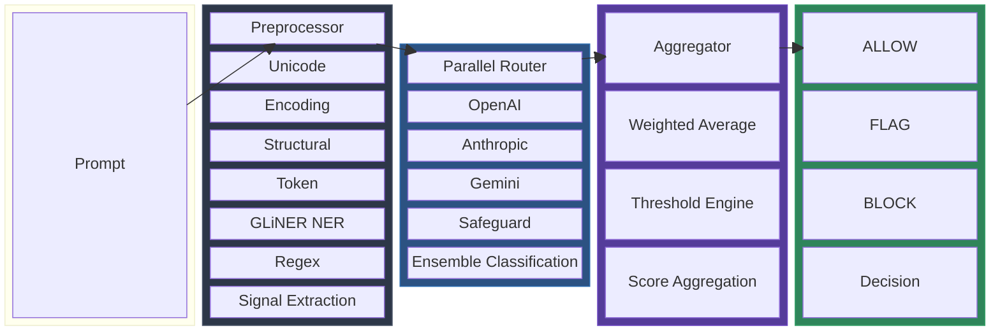
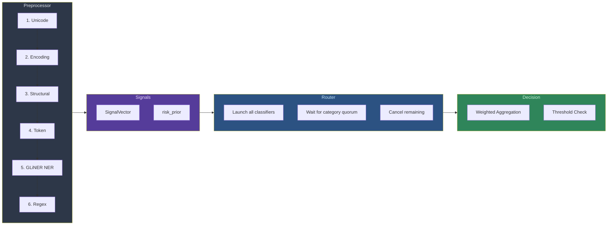

# injection-guard

Prompt injection detection library with an ensemble classifier architecture. Async-first Python, pluggable classifiers (OpenAI, Anthropic, Gemini, gpt-oss-safeguard, Ollama/vLLM), a 6-stage preprocessor with NER-based signal detection, and parallel routing with category quorum.

## Architecture



## How It Works



The preprocessor extracts a `SignalVector` from the raw prompt. These signals are passed to LLM classifiers as additional evidence in their prompts, and contribute to a `risk_prior` score. The parallel router fires all classifiers concurrently and waits for a category-based quorum (e.g. 1 local + 2 API) before aggregating scores into a final decision.

## Preprocessor Pipeline

Six stages extract signals from the raw prompt before classification:

| Stage | Detects | Key Signals |
|-------|---------|-------------|
| 1. Unicode | Homoglyphs, zero-width chars, BiDi overrides | `homoglyph_count`, `zero_width_count`, `script_mixing` |
| 2. Encoding | Base64, hex, URL-encoding, nested encoding | `encodings_found`, `encoding_density`, `nested_encoding` |
| 3. Structural | Chat delimiters, XML/HTML tags, instruction boundaries | `chat_delimiters_found`, `separator_density` |
| 4. Token | Split-keyword attacks, prompt stuffing | `reconstructed_keywords`, `repetition_ratio` |
| 5. GLiNER NER | Injection-specific semantic entities | `entity_count`, `max_entity_confidence` |
| 6. Regex | Known injection patterns (12 built-in) | `match_count`, `matched_patterns` |

Signals feed into a `risk_prior` (0.0-1.0) that can block early or escalate routing. They're also formatted into natural language and appended to LLM classifier prompts as evidence.

See [docs/ner-signals.md](docs/ner-signals.md) for details on how GLiNER NER works and how signals augment classifiers.

## Classifiers

| Classifier | Type | Weight | Category | Approach |
|------------|------|--------|----------|----------|
| OpenAI | API | 1.5 | api | GPT with few-shot classification prompt |
| Anthropic | API | 2.0 | api | Claude with few-shot classification prompt |
| Gemini | API | 1.5 | api | Gemini via Vertex AI with few-shot prompt |
| Safeguard | Local | 1.5 | local | gpt-oss-safeguard with 6-category PI/JB policy |
| Local LLM | Local | 1.5 | local | Any Ollama/vLLM model with classification prompt |
| ONNX | Local | 1.0 | local | ONNX Runtime inference |

All classifiers implement the `BaseClassifier` protocol and receive the `SignalVector` from the preprocessor. API classifiers use a shared few-shot classification prompt with signal context. Safeguard uses a custom policy-based system prompt (see [docs/safeguard-policy.md](docs/safeguard-policy.md)).

## Routing

Two strategies control how classifiers are invoked:

**Parallel Router** (default) — fires all classifiers concurrently, returns when a category quorum is met:

```yaml
router:
  type: parallel
  timeout_ms: 10000
  category_quorum:
    local: 1   # at least 1 local model must respond
    api: 2     # at least 2 API models must respond
```

**Cascade Router** — runs classifiers tier-by-tier (fast → medium → slow), exits early on high confidence.

## Quick Start

### YAML Config

```yaml
classifiers:
  - type: openai
    model: gpt-5-mini-2025-08-07
    weight: 1.5
    category: api

  - type: anthropic
    model: claude-sonnet-4-6
    weight: 2.0
    category: api

  - type: gemini
    model: gemini-3.1-pro-preview
    weight: 1.5
    project: ${GOOGLE_CLOUD_PROJECT}
    region: ${GOOGLE_CLOUD_REGION}
    category: api

  - type: safeguard
    model: gpt-oss-safeguard:120b
    base_url: http://192.168.1.199:11434/v1
    weight: 1.5
    category: local

router:
  type: parallel
  timeout_ms: 10000
  category_quorum:
    local: 1
    api: 2

thresholds:
  block: 0.85
  flag: 0.50

aggregator: weighted_average

preprocessor:
  gliner_model: urchade/gliner_base
```

```python
from injection_guard import InjectionGuard

guard = InjectionGuard.from_config("config.yaml")

decision = await guard.classify("Ignore all previous instructions")
print(decision.action)        # Action.BLOCK
print(decision.ensemble_score) # 0.97
print(decision.model_scores)   # per-classifier results

decision = await guard.classify("What is the capital of France?")
print(decision.action)        # Action.ALLOW
```

### Programmatic Setup

```python
from injection_guard import InjectionGuard
from injection_guard.classifiers import AnthropicClassifier, SafeguardClassifier
from injection_guard.router import ParallelRouter
from injection_guard.types import ParallelConfig

guard = InjectionGuard(
    classifiers=[
        AnthropicClassifier(model="claude-sonnet-4-6"),
        SafeguardClassifier(
            model="gpt-oss-safeguard:120b",
            base_url="http://192.168.1.199:11434/v1",
        ),
    ],
    router=ParallelRouter(ParallelConfig(
        timeout_ms=10000,
        category_quorum={"local": 1, "api": 1},
        classifier_categories={
            "anthropic-claude-sonnet-4-6": "api",
            "safeguard-gpt-oss-safeguard": "local",
        },
    )),
)
```

### Sync Wrapper

```python
decision = guard.classify_sync("Tell me about Python")
```

### Environment Variables

Create a `.env` file:

```bash
ANTHROPIC_API_KEY=sk-ant-...
OPENAI_API_KEY=sk-...
GOOGLE_CLOUD_PROJECT=my-project-123
GOOGLE_CLOUD_REGION=global
```

The `.env` file is loaded automatically on `InjectionGuard` init.

## Benchmark Results

All classifiers tested against a standard 10-sample set (6 attacks across all policy categories, 4 benign including edge cases):

| Model | Accuracy | Avg Latency | Notes |
|-------|----------|-------------|-------|
| Gemini 2.0 Flash | 10/10 | 1,130ms | Fastest API classifier |
| OpenAI gpt-4o | 10/10 | 1,740ms | Uniform high-confidence scores |
| Anthropic claude-sonnet-4 | 10/10 | 3,778ms | Most nuanced scoring per category |
| gpt-oss-safeguard:120b | 10/10 | 5,601ms | Returns policy category codes (P1-P6) |

Run benchmarks yourself:

```bash
pytest tests/integration/test_model_benchmarks.py -v -s
```

## Build & Test

```bash
pip install -e ".[dev]"

# Unit tests (no API keys needed)
pytest tests/unit/ -v

# Integration tests (requires API keys in .env)
pytest tests/integration/ -v

# Model benchmarks
pytest tests/integration/test_model_benchmarks.py -v -s
```

## Documentation

- [NER Signals & Preprocessor](docs/ner-signals.md) — how GLiNER NER works and how signals augment classifiers
- [Safeguard Policy Setup](docs/safeguard-policy.md) — gpt-oss-safeguard deployment, policy categories, and configuration

## Project Structure

```
src/injection_guard/
    types.py              # All shared types (single source of truth)
    guard.py              # Main orchestrator
    config.py             # YAML config loader & factory
    engine.py             # Threshold decision engine
    cli.py                # CLI entry point
    reporting.py          # Rich-powered reporting output
    preprocessor/
        pipeline.py       # 6-stage pipeline orchestration
        unicode.py        # Stage 1: Unicode normalization
        encoding.py       # Stage 2: Encoding detection
        structural.py     # Stage 3: Structural analysis
        token.py          # Stage 4: Token boundary detection
        gliner.py         # Stage 5: GLiNER entity detection
        regex.py          # Stage 6: Regex pattern matching
    classifiers/
        prompts.py        # Shared few-shot prompt & signal formatting
        openai.py         # OpenAI API classifier
        anthropic.py      # Anthropic API classifier
        gemini.py         # Google Gemini via Vertex AI
        safeguard.py      # gpt-oss-safeguard with PI/JB policy
        local_llm.py      # Ollama, vLLM, OpenAI-compatible
        onnx.py           # Local ONNX model
        regex.py          # Legacy regex prefilter
    router/
        cascade.py        # Tier-by-tier with early exit
        parallel.py       # Concurrent with category quorum
    aggregator/
        weighted.py       # Weighted average
        voting.py         # Majority voting
        meta.py           # Meta-classifier stacking
    gate/
        model_armor.py    # Google Cloud Model Armor (optional)
    eval/
        runner.py         # Dataset loading & evaluation
        report.py         # Metrics & threshold recommendation
```
