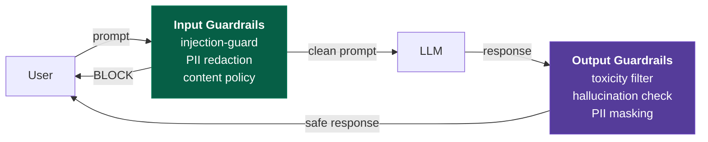
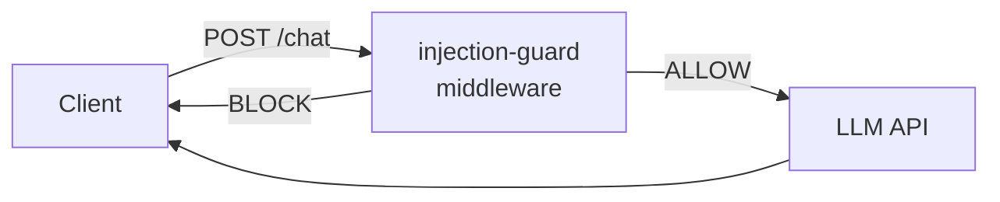
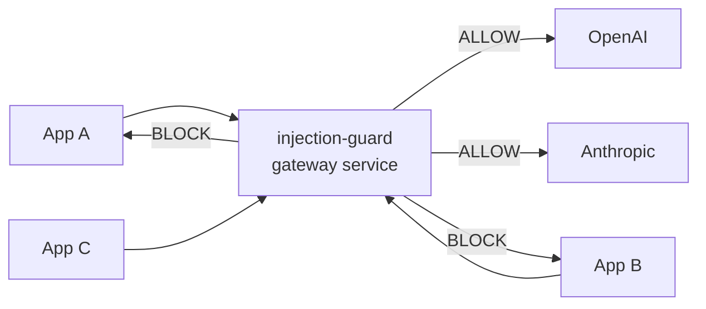
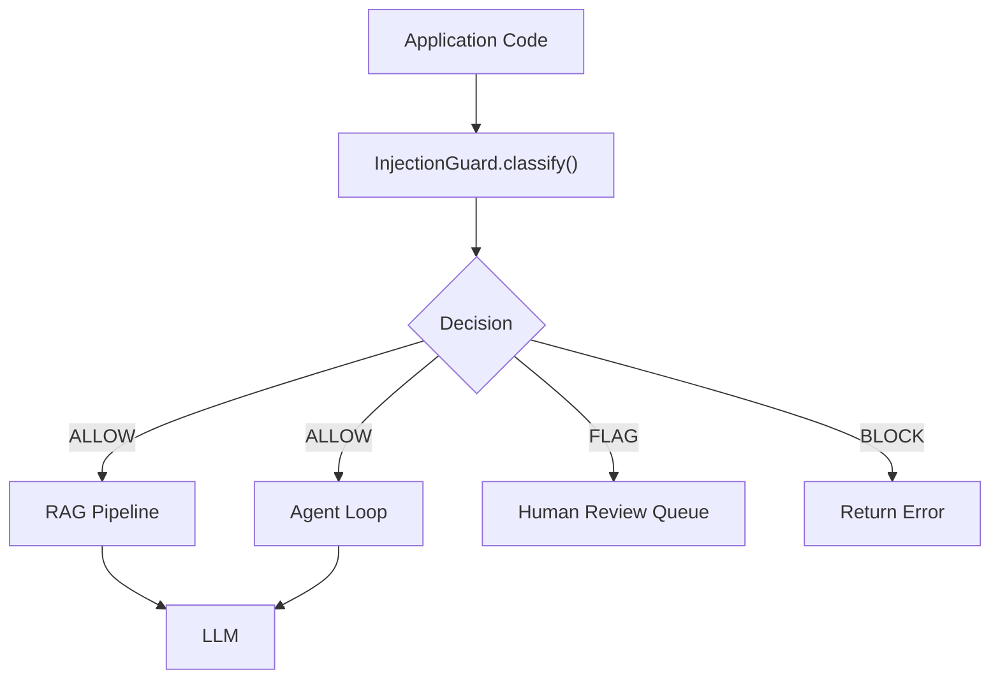

# Deployment Guide

Practical guide for deploying injection-guard as **input guardrails** in production AI applications.

---

## Where injection-guard Fits: The Guardrails Pipeline

injection-guard is the **input guardrails** stage — it inspects user prompts *before* they reach the LLM. It sits alongside other guardrails in a full pipeline:



| Stage | Purpose | injection-guard role |
|-------|---------|---------------------|
| **Input guardrails** | Protect the LLM from malicious input | Primary — prompt injection & jailbreak detection |
| PII redaction | Strip sensitive data before LLM sees it | Complementary — preprocessor detects PII entities via GLiNER |
| Content policy | Block disallowed topics | Complementary — can be combined with injection scoring |
| **Output guardrails** | Protect the user from bad LLM output | Not applicable — injection-guard is input-only |

injection-guard focuses exclusively on the input side. For output guardrails (toxicity, hallucination, PII leakage), integrate separate tools downstream.

---

## 1. Deployment Patterns

### 1A. Sidecar / Middleware

injection-guard runs as middleware in your app's request pipeline, intercepting prompts before they reach the LLM. Simplest pattern for single-app deployments.



Best for: single applications, teams that own the full stack, rapid prototyping.

### 1B. Gateway / Proxy

Standalone service that sits between all clients and LLM APIs. All LLM traffic routes through it, providing centralized policy enforcement.



Best for: multi-app organizations, centralized security teams, compliance-heavy environments.

### 1C. SDK Integration

Import injection-guard directly into application code. The application controls when and how classification happens.



Best for: RAG pipelines, agent frameworks, multi-turn workflows, custom routing logic.

---

## 2. Infrastructure Requirements

### Resource Requirements by Tier

| Component | Starter | Production | Enterprise |
|---|---|---|---|
| **API Classifiers** | API keys only | API keys + connection pooling | API keys + dedicated rate limits |
| **DeBERTa (ONNX)** | CPU (slow) | 1x NVIDIA T4/L4 via litguard | 2-4x A100/H100 via litguard |
| **Safeguard 20B** | -- | 1x GPU, 24GB+ VRAM (Ollama) | Dedicated GPU node |
| **Safeguard 120B** | -- | -- | 1x GPU, 80GB+ VRAM (A100/H100) |
| **GLiNER preprocessor** | CPU (adds ~50ms) | GPU (adds ~10ms) | GPU |
| **Cache layer** | In-process LRU | Redis single node | Redis cluster |
| **Expected throughput** | ~10 req/s | ~200 req/s | ~2000+ req/s |

### Notes

- **API classifiers** require no special infrastructure. Set `OPENAI_API_KEY`, `ANTHROPIC_API_KEY`, and/or `GOOGLE_API_KEY` as environment variables.
- **litguard** (LitServe-based) serves DeBERTa and HF-compatible models. Min GPU: NVIDIA T4 (16GB). Recommended: A100 for batched inference at scale.
- **Ollama** hosts Safeguard models. The 20B model needs ~24GB VRAM; 120B needs ~80GB. Run on a dedicated DGX or cloud GPU instance.
- **GLiNER** runs on CPU by default but benefits from GPU acceleration for high-throughput deployments.
- **Redis** is optional but recommended for production. Use hash-based prompt deduplication with a short TTL (60-300s) to avoid re-classifying identical prompts.

---

## 3. FastAPI Integration

### Middleware Pattern (Async)

```python
from __future__ import annotations

import hashlib
import json
import time
from typing import Any

from fastapi import FastAPI, Request, Response
from fastapi.responses import JSONResponse
from injection_guard import InjectionGuard
from injection_guard.types import Action

app = FastAPI()
guard = InjectionGuard.from_config("config.yaml")


@app.middleware("http")
async def injection_guard_middleware(request: Request, call_next):
    if request.url.path not in ("/v1/chat/completions", "/v1/completions"):
        return await call_next(request)

    body = await request.body()
    try:
        payload = json.loads(body)
    except json.JSONDecodeError:
        return await call_next(request)

    # Extract prompt from OpenAI-compatible format
    messages = payload.get("messages", [])
    user_messages = [m["content"] for m in messages if m.get("role") == "user"]
    if not user_messages:
        return await call_next(request)

    prompt = user_messages[-1]
    decision = await guard.classify(prompt)

    if decision.action == Action.BLOCK:
        return JSONResponse(
            status_code=403,
            content={
                "error": "prompt_blocked",
                "message": "Request blocked by injection detection.",
                "request_id": request.headers.get("x-request-id", ""),
            },
        )

    if decision.action == Action.FLAG:
        # Add header for downstream awareness, but allow through
        response = await call_next(request)
        response.headers["X-Injection-Guard-Flag"] = "true"
        response.headers["X-Injection-Guard-Score"] = f"{decision.ensemble_score:.3f}"
        return response

    return await call_next(request)
```

### Health Check and Metrics Endpoints

```python
from prometheus_client import Counter, Histogram, generate_latest

CLASSIFY_LATENCY = Histogram(
    "injection_guard_classify_seconds",
    "Classification latency",
    buckets=[0.05, 0.1, 0.2, 0.5, 1.0, 2.0, 5.0],
)
CLASSIFY_DECISIONS = Counter(
    "injection_guard_decisions_total",
    "Classification decisions",
    ["action"],  # allow, flag, block
)


@app.get("/healthz")
async def health():
    return {"status": "ok"}


@app.get("/metrics")
async def metrics():
    return Response(content=generate_latest(), media_type="text/plain")


@app.post("/v1/classify")
async def classify_prompt(request: Request):
    """Standalone classification endpoint for gateway pattern."""
    body = await request.json()
    prompt = body["prompt"]

    with CLASSIFY_LATENCY.time():
        decision = await guard.classify(prompt)

    CLASSIFY_DECISIONS.labels(action=decision.action.value).inc()

    return {
        "action": decision.action.value,
        "score": decision.ensemble_score,
        "latency_ms": decision.latency_ms,
        "degraded": decision.degraded,
        "reasoning": decision.reasoning,
        "router_path": decision.router_path,
    }
```

### Sync Pattern (Django / Flask)

```python
from injection_guard import InjectionGuard
from injection_guard.types import Action

guard = InjectionGuard.from_config("config.yaml")

# In a Django view or Flask route:
def chat_view(request):
    prompt = request.json["prompt"]
    decision = guard.classify_sync(prompt)

    if decision.action == Action.BLOCK:
        return JsonResponse({"error": "blocked"}, status=403)

    # Proceed with LLM call...
```

---

## 4. LangChain / LlamaIndex Integration

### LangChain: Custom Chain Wrapper

```python
from __future__ import annotations

from langchain_core.runnables import RunnablePassthrough, RunnableLambda
from injection_guard import InjectionGuard
from injection_guard.types import Action

guard = InjectionGuard.from_config("config.yaml")


async def injection_check(inputs: dict) -> dict:
    prompt = inputs.get("question", inputs.get("input", ""))
    decision = await guard.classify(prompt)

    if decision.action == Action.BLOCK:
        raise ValueError(
            f"Prompt blocked by injection detection (score={decision.ensemble_score:.3f})"
        )

    inputs["_injection_guard"] = {
        "action": decision.action.value,
        "score": decision.ensemble_score,
    }
    return inputs


# Insert into any LangChain pipeline:
safe_chain = RunnableLambda(injection_check) | your_existing_chain
```

### LangChain: Callback Handler

```python
from langchain_core.callbacks import AsyncCallbackHandler
from injection_guard import InjectionGuard
from injection_guard.types import Action

guard = InjectionGuard.from_config("config.yaml")


class InjectionGuardCallback(AsyncCallbackHandler):
    async def on_llm_start(self, serialized, prompts, **kwargs):
        for prompt in prompts:
            decision = await guard.classify(prompt)
            if decision.action == Action.BLOCK:
                raise ValueError(f"Injection detected: score={decision.ensemble_score:.3f}")
```

### LlamaIndex: Query Engine Wrapper

```python
from llama_index.core.query_engine import BaseQueryEngine
from injection_guard import InjectionGuard
from injection_guard.types import Action

guard = InjectionGuard.from_config("config.yaml")


class GuardedQueryEngine:
    """Wraps any LlamaIndex query engine with injection detection."""

    def __init__(self, engine: BaseQueryEngine):
        self._engine = engine

    async def aquery(self, query_str: str, **kwargs):
        decision = await guard.classify(query_str)

        if decision.action == Action.BLOCK:
            raise ValueError(f"Query blocked (score={decision.ensemble_score:.3f})")

        return await self._engine.aquery(query_str, **kwargs)

    def query(self, query_str: str, **kwargs):
        decision = guard.classify_sync(query_str)

        if decision.action == Action.BLOCK:
            raise ValueError(f"Query blocked (score={decision.ensemble_score:.3f})")

        return self._engine.query(query_str, **kwargs)
```

---

## 5. Multi-turn Conversation Handling

Three strategies for classifying conversations:

| Strategy | Latency | Accuracy | Cost | Use When |
|---|---|---|---|---|
| **Per-turn** | Low | Good for direct attacks | Low | Most applications |
| **Sliding window** | Medium | Catches split-across-turns attacks | Medium | Chat apps, customer support |
| **Context-aware** | High | Best overall | High | High-security, financial, healthcare |

### Per-turn (Default)

Classify each user message independently. Simple, fast, sufficient for most cases.

```python
decision = await guard.classify(latest_user_message)
```

### Sliding Window

Concatenate the last N user turns and classify as a single prompt. Catches attacks that are split across multiple messages.

```python
WINDOW_SIZE = 3

recent_user_turns = [
    m["content"] for m in conversation[-WINDOW_SIZE:]
    if m["role"] == "user"
]
combined = "\n---\n".join(recent_user_turns)
decision = await guard.classify(combined)
```

### Context-Aware

Include the system prompt and full conversation history. Most accurate, but higher latency and cost (longer prompts to API classifiers).

```python
context = f"System: {system_prompt}\n\n"
for msg in conversation:
    context += f"{msg['role'].title()}: {msg['content']}\n"

decision = await guard.classify(context)
```

---

## 6. Scaling and Performance

### Latency Expectations by Classifier Tier

| Tier | Classifiers | Typical Latency | When Used |
|---|---|---|---|
| **Fast** | Regex, DeBERTa (ONNX) | 10-50ms | Every request (pre-filter) |
| **Medium** | HFCompatClassifier, Safeguard 20B | 100-300ms | Ambiguous cases from fast tier |
| **Slow** | OpenAI, Anthropic, Gemini API | 500-2000ms | Low-confidence or high-risk prompts |

With the cascade router, ~70% of traffic resolves at the fast tier (sub-200ms). Only ambiguous prompts escalate to API classifiers.

### Horizontal Scaling

injection-guard is stateless. Scale horizontally behind a load balancer.

```
                        ┌─ injection-guard pod 1
Load Balancer ──────────┼─ injection-guard pod 2
                        ├─ injection-guard pod 3
                        └─ injection-guard pod N
                               │
                     ┌─────────┴─────────┐
                  litguard           Redis cache
                (GPU node)          (shared state)
```

### Caching

Use hash-based deduplication to skip re-classification of identical prompts:

```python
import hashlib
from redis.asyncio import Redis

redis = Redis(host="localhost", port=6379)
CACHE_TTL = 300  # 5 minutes


async def classify_with_cache(guard, prompt: str):
    key = f"ig:{hashlib.sha256(prompt.encode()).hexdigest()[:16]}"
    cached = await redis.get(key)
    if cached:
        return json.loads(cached)

    decision = await guard.classify(prompt)
    await redis.setex(key, CACHE_TTL, json.dumps({
        "action": decision.action.value,
        "score": decision.ensemble_score,
    }))
    return decision
```

### Connection Pooling

For API classifiers, use shared `httpx.AsyncClient` instances with connection pooling:

```python
import httpx

# Shared across classifier instances
http_client = httpx.AsyncClient(
    limits=httpx.Limits(max_connections=100, max_keepalive_connections=20),
    timeout=httpx.Timeout(10.0, connect=5.0),
)
```

---

## 7. Monitoring and Observability

### Key Metrics

| Metric | Type | Alert Threshold |
|---|---|---|
| `classify_latency_seconds` (p50/p95/p99) | Histogram | p99 > 3s |
| `decisions_total{action}` | Counter | Block rate spike > 2x baseline |
| `classifier_errors_total{classifier}` | Counter | Error rate > 5% in 5min window |
| `ensemble_agreement_rate` | Gauge | Agreement < 80% (classifiers disagreeing) |
| `degraded_decisions_total` | Counter | Any sustained increase |

### Structured Logging

```python
import structlog

logger = structlog.get_logger()


async def classify_with_logging(guard, prompt, request_id):
    decision = await guard.classify(prompt)

    logger.info(
        "injection_guard.classify",
        request_id=request_id,
        action=decision.action.value,
        score=decision.ensemble_score,
        latency_ms=decision.latency_ms,
        router_path=decision.router_path,
        degraded=decision.degraded,
        classifier_scores={
            name: {"score": r.score, "label": r.label, "latency_ms": r.latency_ms}
            for name, r in decision.model_scores.items()
        },
    )
    return decision
```

### Alerting Rules (Prometheus)

```yaml
groups:
  - name: injection_guard
    rules:
      - alert: HighBlockRate
        expr: rate(injection_guard_decisions_total{action="block"}[5m]) > 2 * rate(injection_guard_decisions_total{action="block"}[1h])
        for: 5m
        annotations:
          summary: "Block rate spike - possible coordinated attack"

      - alert: ClassifierDown
        expr: rate(injection_guard_classifier_errors_total[5m]) > 0.05
        for: 2m
        annotations:
          summary: "Classifier {{ $labels.classifier }} error rate above 5%"

      - alert: HighLatency
        expr: histogram_quantile(0.99, injection_guard_classify_seconds) > 3
        for: 5m
        annotations:
          summary: "p99 classification latency exceeding 3 seconds"
```

### Grafana Dashboard Panels

Recommended panels: classification latency heatmap, decision distribution over time (stacked bar: allow/flag/block), classifier error rate per classifier, ensemble agreement rate, and router path distribution (how often each tier is reached).

---

## 8. Security Considerations

### API Key Management

Never put API keys in config files. Use environment variables or a secrets manager.

```bash
# .env (never commit this file)
OPENAI_API_KEY=sk-...
ANTHROPIC_API_KEY=sk-ant-...
GOOGLE_API_KEY=AIza...
```

injection-guard loads `.env` automatically via `python-dotenv`. For Kubernetes, use Secrets:

```yaml
env:
  - name: OPENAI_API_KEY
    valueFrom:
      secretKeyRef:
        name: injection-guard-secrets
        key: openai-api-key
```

### Network Security

- litguard and Ollama endpoints must not be exposed to the public internet. Use private networking or VPN.
- If litguard runs on a DGX node, restrict access to the injection-guard service pods only.
- Use mTLS between injection-guard and GPU inference services in production.

### Graceful Degradation

Choose a failure mode based on your risk tolerance:

| Mode | Behavior | Config | Use When |
|---|---|---|---|
| **Fail-open** | Allow traffic when classifiers are down | Default (degraded=True on Decision) | Low-risk apps, user-facing chat |
| **Fail-closed** | Block traffic when classifiers are down | Check `decision.degraded` and reject | Financial, healthcare, compliance |

```python
decision = await guard.classify(prompt)

# Fail-closed: reject if any classifier failed
if decision.degraded:
    return JSONResponse(status_code=503, content={"error": "classification_unavailable"})
```

### Audit Trail

For compliance, log every classification to a durable store:

```python
async def audit_log(decision, prompt_hash, request_id):
    await audit_store.write({
        "timestamp": datetime.utcnow().isoformat(),
        "request_id": request_id,
        "prompt_hash": prompt_hash,  # hash, not raw prompt
        "action": decision.action.value,
        "score": decision.ensemble_score,
        "router_path": decision.router_path,
        "classifier_scores": {
            name: {"score": r.score, "label": r.label}
            for name, r in decision.model_scores.items()
        },
        "degraded": decision.degraded,
        "latency_ms": decision.latency_ms,
    })
```

### Rate Limiting

Protect the guard itself from abuse. Apply rate limits upstream:

```python
from slowapi import Limiter
limiter = Limiter(key_func=get_remote_address)

@app.post("/v1/classify")
@limiter.limit("100/minute")
async def classify_prompt(request: Request):
    ...
```

---

## 9. Configuration for Common Scenarios

### Cost-Optimized (Local Models Only)

No API calls. Requires GPU infrastructure for DeBERTa/litguard.

```yaml
classifiers:
  - type: regex
  - type: onnx
    model_path: models/deberta-injection.onnx
    weight: 2.0

router:
  type: cascade
  timeout_ms: 300
  fast_confidence: 0.85

thresholds:
  block: 0.85
  flag: 0.50

aggregator: weighted_average

preprocessor:
  gliner_model: urchade/gliner_base
  preprocessor_block_threshold: 0.9
```

### Latency-Optimized (DeBERTa Pre-filter, API for Ambiguous)

~70% of traffic resolves in under 200ms via DeBERTa. Only ambiguous prompts hit API classifiers.

```yaml
classifiers:
  - type: regex
  - type: onnx
    model_path: models/deberta-injection.onnx
    weight: 2.0
  - type: openai
    model: gpt-5-mini-2025-08-07
    weight: 1.5

router:
  type: cascade
  timeout_ms: 500
  fast_confidence: 0.85

thresholds:
  block: 0.85
  flag: 0.50

aggregator: weighted_average

preprocessor:
  gliner_model: urchade/gliner_base
  preprocessor_block_threshold: 0.9
```

### Accuracy-Optimized (Full Ensemble)

All classifiers run. Highest accuracy, highest cost and latency.

```yaml
classifiers:
  - type: regex
  - type: onnx
    model_path: models/deberta-injection.onnx
    weight: 2.0
  - type: anthropic
    model: claude-sonnet-4-6
    weight: 2.0
  - type: openai
    model: gpt-5-mini-2025-08-07
    weight: 1.5
  - type: gemini
    model: gemini-3-flash-preview
    weight: 1.5
    project: ${GCP_PROJECT_ID}
    region: ${GCP_REGION}
  - type: hf_compat
    model: your-org/deberta-injection-ft
    base_url: http://litguard.internal:8000
    weight: 1.5

router:
  type: parallel
  timeout_ms: 2000
  quorum: 3

thresholds:
  block: 0.80
  flag: 0.45

aggregator: weighted_average

preprocessor:
  gliner_model: urchade/gliner_base
  preprocessor_block_threshold: 0.9
```

### Compliance-Heavy (Fail-Closed, Full Audit)

Full ensemble, all classifiers required, fail-closed on degradation.

```yaml
classifiers:
  - type: regex
  - type: onnx
    model_path: models/deberta-injection.onnx
    weight: 2.0
  - type: anthropic
    model: claude-opus-4-6
    weight: 2.5
  - type: openai
    model: gpt-5.4
    weight: 2.0
  - type: gemini
    model: gemini-3.1-pro-preview
    weight: 2.0
    project: ${GCP_PROJECT_ID}
    region: ${GCP_REGION}

router:
  type: parallel
  timeout_ms: 5000
  quorum: 4

thresholds:
  block: 0.75
  flag: 0.40

aggregator: voting

preprocessor:
  gliner_model: urchade/gliner_base
  preprocessor_block_threshold: 0.85
```

In application code, enforce fail-closed:

```python
decision = await guard.classify(prompt)
if decision.degraded or decision.action in (Action.BLOCK, Action.FLAG):
    # Log to audit trail, reject request
    await audit_log(decision, prompt_hash, request_id)
    return JSONResponse(status_code=403, content={"error": "blocked"})
```
